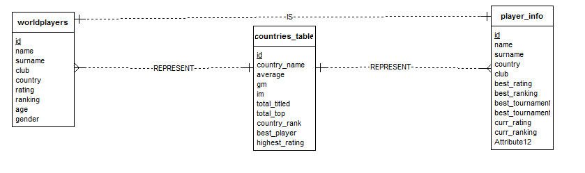

Developer Guide
===============

Database Design
---------------

.. literalinclude:: itucsdb1513/server.py
    :language: python
    :lines: 12-40
    :emphasize-lines: 2

    Database of *Chess* project.

In our project database design is implemented separately by each member.
For this reason the database design details are going to be covered separately by each member of the team.
As a result E-R diagrams are also going to be shown separately by each member. Each member will explain in details corresponding components of database design implemented by that member.

You can find E/R diagrams and codes for each member in their developer guide section.

Database is created using ElephantSQL services. ElephantSQL runs PostgreSQL servers.
The project can be accessed from https://hub.jazz.net/ by developers.
Developers have to login to hub.jazz in order to access database. The project is also built and run in bluemix and can be run from http://itucsdb1513.mybluemix.net/

The code is also hosted on github.

1. Ira Shyti's database connections and E-R diagram
^^^^^^^^^^^^^^^^^^^^^^^^^^^^^^^^^^^^^^^^^^^^^^^^^^^
E-R diagram for *upcoming events* and *championships* tables. The tables are connected with each other because the 
championship attribute of *championships* table is a foreign key to the championship attribute of the *upcoming events* 
table.

.. figure:: Ira_pics/cha_er.jpeg
      :align:   center
      :scale: 50 %
      :alt: E-R diagram

      *E-R diagram of upcoming events and championships tables*
      
     
E-R diagram for *history* table. This is a simple table. It does nothaveany foreign key.
    
.. figure:: Ira_pics/hist_er.jpeg
      :align:   center
      :scale: 50 %
      :alt: E-R diagram of history

      *E-R diagram of history table*

2. Javid Nuriyev's database connections and E-R diagram
^^^^^^^^^^^^^^^^^^^^^^^^^^^^^^^^^^^^^^^^^^^^^^^^^^^^^^^

2.1 Database Design
"""""""""""""""""""

In this part of the project there are 3 tables implemented. Those are Player Rankings table, Countries Rankings Table, and Player Info Table.
The Player Rankings Table is created with the postgreSQL code in elephantSQL:

.. code-block:: python

   CREATE TABLE worldplayers (
                        id serial PRIMARY KEY,
                        name text NOT NULL,
                        surname text NOT NULL,
                        country text NOT NULL REFERENCES countries_table(country_name) ON UPDATE CASCADE ON DELETE RESTRICT,
                        club text NOT NULL,
                        rating integer DEFAULT 0,
                        ranking integer DEFAULT 0,
                        age integer DEFAULT 0,
                        gender text NOT NULL,
                        UNIQUE (name, surname));

In the code shown above it can be noticed that a table references countries table and when the player's country is updated it is updated in both tables.
Moreover the country can not be deleted while player refereces this country thanks to the "RESTRICT" statement.
One more important point worthy to mention is that name , surname pair is unique in this table.

Another table implemented by this developer is countries Ranking Table.

.. code-block:: python

       CREATE TABLE countries_table (
                        id serial PRIMARY KEY,
                        country_name text UNIQUE NOT NULL,
                        average integer DEFAULT 0,
                        gm integer DEFAULT 0,
                        im integer DEFAULT 0,
                        total_titled integer DEFAULT 0,
                        total_top integer DEFAULT 0,
                        country_rank integer DEFAULT 0,
                        best_player text UNIQUE NOT NULL,
                        highest_rating integer DEFAULT 0);

In this table the primary key is id, and the best_player is unique. those re the major features of this table.

The last table implemented by this developer is Player Info table which shows information about players in the top rankings table.

.. code-block:: python

      CREATE TABLE player_info (
                        id serial PRIMARY KEY,
                        name text NOT NULL,
                        surname text NOT NULL,
                        country text NOT NULL REFERENCES countries_table(country_name) ON UPDATE CASCADE ON DELETE RESTRICT,
                        club text NOT NULL,
                        best_rating integer DEFAULT 0,
                        best_ranking integer DEFAULT 0,
                        best_tournament text NOT NULL,
                        best_tournament_result text NOT NULL,
                        curr_rating integer DEFAULT 0,
                        curr_ranking integer DEFAULT 0,
                        FOREIGN KEY (name, surname) REFERENCES worldplayers(name, surname) ON UPDATE CASCADE ON DELETE CASCADE  );

In this table id is a primary key as well. Each country here references country from the countries table and when a country is updated this country is updated in both tables because of the "CASCADE" statement.
Furthermore, the country can not be deleted if it is referenced by info of the player thanks to the "RESTRICT" statement.
Also it is important to mention that foreign key here is a name, surname pair which is unique in this table and it points to the name, surname pair of the players in worldplayers table.

2.2 ER Diagram
""""""""""""""

ER diagram of the database entities created in this part of the project :

      *Entity/Relation diagram*

3. Mursit Sezen's database connections and E-R diagram
^^^^^^^^^^^^^^^^^^^^^^^^^^^^^^^^^^^^^^^^^^^^^^^^^^^^^^

4. Ahmet Gulum's database connections and E-R diagram
^^^^^^^^^^^^^^^^^^^^^^^^^^^^^^^^^^^^^^^^^^^^^^^^^^^^^

5. Ahmet Turk's database connections and E-R diagram
^^^^^^^^^^^^^^^^^^^^^^^^^^^^^^^^^^^^^^^^^^^^^^^^^^^^

Database Connections of the project
^^^^^^^^^^^^^^^^^^^^^^^^^^^^^^^^^^^
We have implemented connections of the database in the server.py file where all the core python functions are implemented.
The codes shown below were used to implement the database connections of the project.

.. code-block:: python

   def get_elephantsql_dsn(vcap_services):
       """Returns the data source name for ElephantSQL."""
       parsed = json.loads(vcap_services)
       uri = parsed["elephantsql"][0]["credentials"]["uri"]
       match = re.match('postgres://(.*?):(.*?)@(.*?)(:(\d+))?/(.*)', uri)
       user, password, host, _, port, dbname = match.groups()
       dsn = """user='{}' password='{}' host='{}' port={}
             dbname='{}'""".format(user, password, host, port, dbname)
      return dsn

.. code-block:: python

   if __name__ == '__main__':
    VCAP_APP_PORT = os.getenv('VCAP_APP_PORT')
    if VCAP_APP_PORT is not None:
        port, debug = int(VCAP_APP_PORT), False
    else:
        port, debug = 5000, True

    VCAP_SERVICES = os.getenv('VCAP_SERVICES')
    if VCAP_SERVICES is not None:
        app.config['dsn'] = get_elephantsql_dsn(VCAP_SERVICES)
    else:
        app.config['dsn'] = """user='vagrant' password='vagrant'
                               host='localhost' port=5432 dbname='itucsdb'"""

    app.run(host='0.0.0.0', port=port, debug=debug)

.. toctree::

   Ahmet Turk
   Ira Shyti
   Javid Nuriyev
   Mursit Sezen
   Ahmet Gulum
