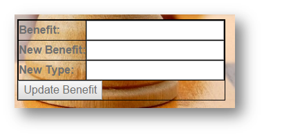
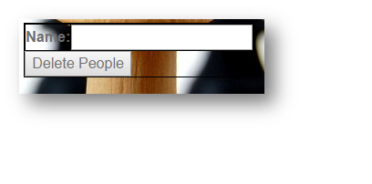

Parts Implemented by Ahmet Gülüm
================================

To access Benefits page from home page of *Chess*, click *Benefits* bar as shown below picture.

      *This is the main page*

Benefits Page
+++++++++++++

      *This is the benefits page*

Benefit Table

+-----------+--------+---------------------+-+
| Attribute | Type   | Explanation         | |
+===========+========+=====================+=+
| id        | serial | ID of the benefits  | |
+-----------+--------+---------------------+-+
| Benefit   | string | Name of the Benefit | |
+-----------+--------+---------------------+-+
| Type      | string | Type of the Benefit | |
+-----------+--------+---------------------+-+

In this table there are 2 columns displayed to the user. Id column is not displayed.

There are five operations that can be carried on the table. Those are:
  - Add Benefit
  - Find Benefit
  - Find Benefit by Type
  - Delete Benefit
  - Update Benefit

Add Benefit
-----------

If the user wants to add a benefit to the table the user should fill the fields shown below and click on the button "Add Benefit".

|

After the user fills the fields and clicks on the "Add Benefit" the benefit is added to the table and displayed in it.

Delete Benefit
--------------
A benefit can be deleted from the table by name.
After entering the name to be deleted , "Delete Benefit" button is clicked.

|

Find Benefit
------------

A benefit can be searched by typing name of it which the user wants to display.
After the name is typed into the field, the "Find Benefit" button should be clicked to perform the action.
Search results will be shown below of the benefits page under the search results 1.

|

Result of the search operation.

.. figure:: gulum_picture/searchresult1.png
      :scale: 50 %
      :alt: Found Benefits is shown below of the page
|

Find Benefit by Type
--------------------
The benefit can be searched by typing type of it which the user wants to display.
After the type is entered into the field, the "Find Benefit by Type" button should be clicked to perform the action.
Search results will be shown below of the benefits page under the search results 1.

|

Result of the search operation.

|

Update Benefit
--------------

To update a benefit , the user should type new name and new type of benefit, then click "Update Benefit".

|

People Table

+-----------+--------+-------------------------+-+
| Attribute | Type   | Explanation             | |
+===========+========+=========================+=+
| Peopleid  | serial | ID of people            | |
+-----------+--------+-------------------------+-+
| Name      | string | Name of person          | |
+-----------+--------+-------------------------+-+
| Benefit   | string | Benefit that person has | |
+-----------+--------+-------------------------+-+

In this table there are 2 columns displayed to the user. Peopleid column is not displayed.

There are five operations that can be carried on the table. Those are:
  - Add People
  - Find People
  - Find People by Benefit
  - Delete People
  - Update People

Add People
----------

If the user wants to add a person to the table, the user should fill the fields shown below and click on the button "Add People".

.. figure:: gulum_picture/addpeople.png
      :scale: 50 %
      :alt: Add People
|

After the user fills the fields and clicks on the "Add People" the person is added to the table and displayed in it.

Delete People
-------------
The person can be deleted from the table by name.
After entering the name to be deleted , "Delete People" button is clicked.

|

Find People
-----------

The person can be searched by typing name of it which the user wants to display.
After the name is typed into the field, the "Find People" button should be clicked to perform the action.
Search results will be shown below of the benefits page under the search results 2.

|

Result of the search operation.

|

Find People by Benefit
----------------------
The person can be searched by typing Benefit that he has, which the user wants to display.
After the benefit is entered into the field, the "Find People by Benefit" button should be clicked to perform the action.
Search results will be shown below of the benefits page under the search results 2.

|

Result of the search operation.

|

Update People
-------------

To update a person , the user should type name of the person, new name and new benefit, then click "Update People".

|

Relation Table

+-----------+--------+-------------------------+-+
| Attribute | Type   | Explanation             | |
+===========+========+=========================+=+
| id        | serial | ID of relation          | |
+-----------+--------+-------------------------+-+
| Name      | string | Name of person          | |
+-----------+--------+-------------------------+-+
| Benefit   | string | Benefit that person has | |
+-----------+--------+-------------------------+-+
| Duration  | string | Duration of Benefit     | |
+-----------+--------+-------------------------+-+

In this table there are 3 columns displayed to the user. Peopleid column is not displayed.

There are five operations that can be carried on the table. Those are:
  - Add Relation
  - Find Relation
  - Find Relation by duration
  - Delete Relation
  - Update Relation

Add Relation
------------

If the user wants to add a relation to the table, the user should fill the fields shown below and click on the button "Add Relation".

|

After the user fills the fields and clicks on the "Add Relation" the relation is added to the table and displayed in it.

Delete Relation
---------------
The relation can be deleted from the table by name.
After entering the name to be deleted , "Delete Relation" button is clicked.

|

Find Relation
-------------

The relation can be searched by typing name of it which the user wants to display.
After the name is typed into the field, the "Find Relation" button should be clicked to perform the action.
Search results will be shown below of the benefits page under the search results 3.

|

Result of the search operation.

|

Find Relation by Duration
-------------------------
The relation can be searched by typing duration, which the user wants to display.
After the duration is entered into the field, the "Find Relation by Duration" button should be clicked to perform the action.
Search results will be shown below of the benefits page under the search results 3.

|

Result of the search operation.

|

Update Relation
---------------

To update a relation , the user should type name of the person, new name , new benefit and new duration, then click "Update Relation".

|

