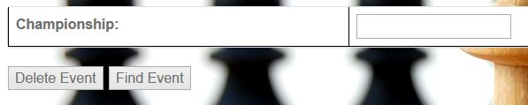

Parts Implemented by Ira Shyti
==============================

The user canacces the "Upcoming events" table and the "Championships" table by clicking the *upcoming events* button on the
top of the home page. The *History* table can be accessed by pressing the history button.

Upcoming events
---------------
The *upcoming events* table has six columns and the primary key of the table is the *number*. The user
can do *add*, *delete*, *find* and *update* operations on this table. The user should take in considerance that the
*championship* attribute of this table is refereced from the *championships* table.

+--------------+--------+------------------------------+
| Attribute    | Type   | Explanation                  |
+==============+========+==============================+
| number       | serial | number of the event          |
+--------------+--------+------------------------------+
| date         | text   | date of the event            |
+--------------+--------+------------------------------+
| place        | text   | place of the event           |
+--------------+--------+------------------------------+
| player1      | text   | first player                 |
+--------------+--------+------------------------------+
| player2      | text   | second player                |
+--------------+--------+------------------------------+
| championship | text   | chapionship event is part of |
+--------------+--------+------------------------------+

Add event
+++++++++
The user can add an event by entering all the information that is required. The user should take in considerance that all data
should be completed since in the SQL code they are defined as not NULL. Another thing that should be considered also is that
can not add an event of the same date with any event that is already on the table. Another restriction is also the fact that
the championship attribute is referenced by the *championship*table, so the user can not add any event of a championship that
is not pasrt of the championship table.

.. figure:: Ira_pics/add_event.JPG
      :align:   center
      :scale: 50 %
      :alt: Add event

      *Add event table*

Find or Delte event
+++++++++++++++++++
For the *upcoming events* table there are 3 different ways by which a user can find or delete an event. First way is to find
or delte an event by its number. User enters the number of the event and than chooses one of the options, add or delete, and
presses the respective button. The second way is by entering the date and place of the event. And the last way is by entering
the championship that the events is part of. When choosing to find an event by its championship, all the events of the entered
championship will be shown.

.. figure:: Ira_pics/find_ev_nr.JPG
      :align:   center
      :scale: 50 %
      :alt: Find or delte event by number

      *Find or delte event by number*

.. figure:: Ira_pics/find_ev_name.JPG
      :align:   center
      :scale: 50 %
      :alt: Find or delte event by date and place

      *Find or delte event by date and place*

      *Find or delte event by championship name*

Update event
++++++++++++
The user can update an event by pressing the *update event* button on the rightmost column of the event they want to update.
When the user presses the *update event* button,  new page will open which shows a table with all the attributes of the event.
The user should take in considerance that the championship attribute can not be edited since it is referenced to the
*championships* table.

      *Update event table*

Championships table
-------------------
The *championship* table has five columns. The table shows nformation of the championship, when will it take place, the
number of total players that will participate, and the number of tatal games that will be played.The primary key of the
table is the number attribute. This tables *championship* attribute is a foreign key to the *upcoming events* table.

+--------------+---------+----------------------------+
| Attribute    | Type    | Explanation                |
+==============+=========+============================+
| number       | serial  | number of the championship |
+--------------+---------+----------------------------+
| championship | text    | name of championship       |
+--------------+---------+----------------------------+
| year         | integer | year of championship       |
+--------------+---------+----------------------------+
| players      | integer | number of players          |
+--------------+---------+----------------------------+
| games        | integer | number of games            |
+--------------+---------+----------------------------+

Add championship
++++++++++++++++
A user can add a championship in the table by filling the *add championship* table. All informations must be filled since none
of the attributes can be empty. The user should take in considerance that a championship that already is in the table because
championships are unique. After adding all the information, user can press *add championship* key and the new championship will
be shown in the table.

      *Add championship table*

Find or delte championship
++++++++++++++++++++++++++
For the championships table there are two ways by which the user can find or delete a championship. The first way is by using
its number on the table and the second way is by entering the championships name. The user should take in considerance that
a championship that has events that are part of that championship in the *upcoming events* table can not be delted. The user can
enter the number or name of championship and than press the buttons based on the operation they want to perform.

      *Find or delete championship by number*

      *Find or delete championship by name*

Update championshiop
++++++++++++++++++++
The user can update a championship by pressing the name of the championship that they want to update. Anew page will open that
shows a table filled with the information of the choosen championship. The user can change any value of the championship but
should take in considerance that can enter only number values for year, playes and games. Another thing that should be taken in
considerance is the fact that the user can not change the name of a championship that has events planned in the *upcoming events*
table. After updating the information the user should press the *Update Tour* button and the changes will be shown in table.

      *Update championship table*

History table
-------------
The user can find some fact regarding to the history of chess in this table. The history table is not related with any other
table. The *history* table has four columns and its primary key is the number. It shows information about the date, place and
the fact.

+-----------+--------+-----------------------------+
| Attribute | Type   | Explanation                 |
+===========+========+=============================+
| number    | serial | number of fact              |
+-----------+--------+-----------------------------+
| date      | text   | date that the fact happened |
+-----------+--------+-----------------------------+
| place     | text   | place where fact happened   |
+-----------+--------+-----------------------------+
| fact      | text   | historical fact             |
+-----------+--------+-----------------------------+

Add fact
++++++++
The user can add historical facts in the table by coompleting the add fact table. All information should be completed except
from the place information, which can be empty if the place where the fact has happened is unknown. After entering the information
theuser should press the *add fact* button and the fact will be shown in the table.

      *Add historical fact*

Find or delte fact
++++++++++++++++++
There are two ways by which a user can find or delete a fact from the history table. First way is by entering the number of the
fact in the table, and the second way is by entering the date, the place of both of these informations. Then the user presses
one of the buttons based on the operations that wants to perform.

      *Find fact by number*

      *Find fact by date or place*

Update fact
+++++++++++
The user can update a fact by pressing on top of the date of the fact. A new page will open showing a table that contains
the information of the fact choosen to be updated. The user can change the information and then press the *update fact*
button. The updated fact will be shown in the history table.

.. figure:: Ira_pics/update_fact.JPG
      :align:   center
      :scale: 50 %
      :alt: Update fact
      
      *Update fact*
