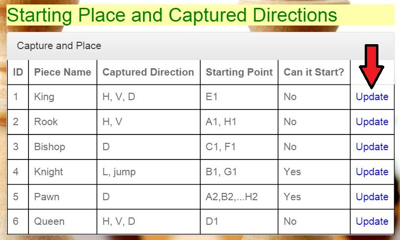

Parts Implemented by Murşit Sezen
=================================

* To access Rules page from home page of *Chess*, click *Rules* bar as shown below picture.

      *Home page of Chess*

Movement Table
--------------

* Movement table of Rules Page and its features.

      *Movement of Pieces*

* The attributes which they have abbreviations are explained under the table header.

+--------------+--------+---------------------------+
| Attribute    | Type   | Explanation               |
+==============+========+===========================+
| id           | serial | id of the piece           |
+--------------+--------+---------------------------+
| Piece Name   | string | Name of the Piece         |
+--------------+--------+---------------------------+
| Piece Move   | string | Movement in the board     |
+--------------+--------+---------------------------+
| Special Move | string | Special movement in board |
+--------------+--------+---------------------------+

Movement Table has 4 attributes.
In this table *id* is primary key and its type is serial.
Other attributes are in text type and related with the *piece name*.
The user can do four operations in this table. Those are:
   - Add Piece
   - Delete Piece
   - Find Piece
   - Update Piece

Adding Piece
++++++++++++

* At the same page where the table is displayed below the table there are fields which should be filled.
* If the user wants to add a piece to the table the user should fill the fields shown below and click on the button *Add Piece*.
* While adding a new piece, the user should take in considerance that the new piece can not have the same name with any other
  piece in the table since the name attribute is unique.

      *Adding part of movement table*

After the user fills the fields and clicks on the "Add Piece" the added piece is added to the table and displayed in it.

Delete Piece
++++++++++++

* The piece can be deleted from the list. To delete a piece from the list a user needs to write the name and move
  of the piece to be deleted ito the necessary box.
* While deleting piece from table, the user should take in considerance that the piece can not be in the Capture Table,
  since Capture Table is referenced to Movement Table and a shared data can not be deleted from movement table.
* After entering the name and the move of the piece to be deleted *Delete Piece* button is clicked.

.. figure:: mursit_picture/del_find_mov.JPG
      :align: center
      :scale: 50 %
      :alt: Delete Piece

      *Removing piece from table*

Find Piece
++++++++++

* The piece can be searched by typing name and move of the piece which the user wants to display.
* After the name and move is typed into the fields the *Find Piece* button should be clicked to perform the action.
* The fields where the name and the move of the piece should be written are located below the *Adding Piece* part as shown below.

.. figure:: mursit_picture/del_find_mov.JPG
      :align: center
      :scale: 50 %
      :alt: Find Piece

      *Finding Movement of the Pieces by name and move*

- After the piece name and move is typed into the fields and the button is clicked a new page opens in which the piece
  whose name and move was typed is displayed with all the data of this piece displayed.

      *Displaying found piece*

Initialize Table
++++++++++++++++

      - To initialize the table you can click *Initialize Table*  button under the delete and find piece table as shown
        above in the screenshot of delete and find piece table .

Update Piece
++++++++++++

* To update the data of the piece there are *Update* buttons to the right of each piece in the Movement.
  These buttons can be noticed in the image of the Movement Table illustrated above.
* When the user wants to update the data of the piece in the Movement Table it is enough to click
  on the corresponding *Update* button as shown below.

      *Clicking on the "Update" button to update a piece*

* After clicking on the "Update" button a new page is opened. On the new page data of the piece that was chosen to be updated by the user is displayed.
* Each field can be updated by modifying the data written in the fields and clicking *Update* button.
* The page mentioned above is illustrated in the figure below.

      *Updating piece data*

* If the data is exist in the Capture Table, the name of the piece can not be changed;
  since Capture Table is referenced from Movement Table with attribute *piece name*.

Capture and History Table
-------------------------

* Capture table of Rules Page and its features.

      *Capture Directions of Pieces*

* The attributes which they have abbreviations are explained under the table header.

+-------------------+--------+------------------------------------------+
| Attribute         | Type   | Explanation                              |
+===================+========+==========================================+
| id                | serial | id of the piece                          |
+-------------------+--------+------------------------------------------+
| Piece Name        | string | Name of the Piece                        |
+-------------------+--------+------------------------------------------+
| Capture Direction | string | Capture Direction of Piece               |
+-------------------+--------+------------------------------------------+
| Starting Point    | string | Starting point of piece                  |
+-------------------+--------+------------------------------------------+
| Can it start?     | string | Whether if the piece can it start or not |
+-------------------+--------+------------------------------------------+

Capture Table has 5 attributes.
In this table *id* is primary key and its type is serial.
Other attributes are in text type and related with the *piece name*.
The user can do four operations in this table. Those are:
   - Add Capture
   - Delete Capture
   - Find Capture
   - Update Capture

Adding Capture
++++++++++++++

* At the same page where the table is displayed below the table there are fields which should be filled.
* If the user wants to add a capture information of a piece to the table the user should fill the fields shown below and click on the button *Add Capture*.
* While adding a new capture, the user should take in considerance that the new capture's piece name can not have the same name with any other
  piece in the table since the name attribute is unique.
* The user should also take in considerance that the new capture should be in the Movement table since Capture Table is
  referenced from Movement Table

      *Adding part of capture table*

After the user fills the fields and clicks on the *Add Capture* the added capture is added to the table and displayed in it.

Delete Capture
++++++++++++++

* The capture can be deleted from the list. To delete a capture from the list a user needs to write the name
  of the piece to be deleted ito the necessary box.
* After entering the name of the piece to be deleted *Delete Capture* button is clicked.

      *Removing capture from table*

Find Capture
++++++++++++

* The capture's data information can be searched by typing name of the piece which the user wants to display.
* After the name is typed into the fields the *Find Capture* button should be clicked to perform the action.
* The fields where the name of the piece should be written are located below the *Adding Capture* part as shown below.

      *Finding Capture of the Pieces by name*

- After the piece name is typed into the fields and the button is clicked a new page opens in which the piece
  whose name was typed is displayed with all the data of this piece displayed.

      *Displaying found capture*

Initialize Table
++++++++++++++++

      - To initialize the table you can click *Initialize Table*  button under the delete and find capture table as shown
        above in the screenshot of delete and find piece table .

Update Capture
++++++++++++++

* To update the data of the capture there are *Update* buttons to the right of each piece in the Capture Table.
  These buttons can be noticed in the image of the Capture Table illustrated above.
* When the user wants to update the data of the capture in the Capture Table it is enough to click
  on the corresponding *Update* button as shown below.

      *Clicking on the "Update" button to update a capture*

* After clicking on the "Update" button a new page is opened. On the new page data of the capture that was chosen to be updated by the user is displayed.
* Each field can be updated by modifying the data written in the fields and clicking *Update* button.
* The page mentioned above is illustrated in the figure below.

      *Updating capture data*

* If the data is exist in the Movement Table, the name of the piece can not be changed;
  since Capture Table is referenced from Movement Table with attribute *piece name*.

History of Rules Table
----------------------

* History of Rules table of Rules Page and its features.

      *History of Rules*

* The attributes which they have abbreviations are explained under the table header.

+-----------+--------+----------------------+
| Attribute | Type   | Explanation          |
+===========+========+======================+
| id        | serial | id of the rule       |
+-----------+--------+----------------------+
| The Rule  | string | Name of the Rule     |
+-----------+--------+----------------------+
| Made by   | string | Made by of the rule  |
+-----------+--------+----------------------+
| Date      | string | Date of founded rule |
+-----------+--------+----------------------+

History Table has 4 attributes.
In this table *id* is primary key and its type is serial.
Other attributes are in text type and related with the *piece name*.
The user can do four operations in this table. Those are:
   - Add Rule
   - Delete Rule
   - Find Rule
   - Update Rule

Adding Rule
+++++++++++

* At the same page where the table is displayed below the table there are fields which should be filled.
* If the user wants to add a rule to the table the user should fill the fields shown below and click on the button *Add Rule*.
* While adding a new rule, the user should take in considerance that the new rule can not have the same name with any other
  rule in the table since the rule attribute is unique.

      *Adding part of History table*

After the user fills the fields and clicks on the *Add Rule* the added ruole is added to the table and displayed in it.

Delete Rule
+++++++++++

* The rule can be deleted from the list. To delete a rule from the list a user needs to write the name
  of the rule to be deleted ito the necessary box.
* After entering the name of the rule to be deleted *Delete Rule* button is clicked.

      *Removing rule from table*

Find Piece
++++++++++

* The rule can be searched by typing name of the rule which the user wants to display.
* After the name is typed into the fields the *Find Rule* button should be clicked to perform the action.
* The fields where the name of the rule should be written are located below the *Adding Rule* part as shown below.

      *Finding History of the Rules by name of the rule*

- After the rule name is typed into the fields and the button is clicked a new page opens in which the rule
  whose name was typed is displayed with all the data of this rule displayed.

      *Displaying found rule*

Initialize Table
++++++++++++++++

      - To initialize the table you can click *Initialize Table*  button under the delete and find rule table as shown
        above in the screenshot of delete and find rule table .

Update Piece
++++++++++++

* To update the data of the rule there are *Update* buttons to the right of each piece in the History of the Rule Table.
  These buttons can be noticed in the image of the History of Rules Table illustrated above.
* When the user wants to update the data of the rule in the History of Rule Table it is enough to click
  on the corresponding *Update* button as shown below.

      *Clicking on the "Update" button to update a rule*

* After clicking on the "Update" button a new page is opened. On the new page data of the rule that was chosen to be updated by the user is displayed.
* Each field can be updated by modifying the data written in the fields and clicking *Update* button.
* The page mentioned above is illustrated in the figure below.

      *Updating rule data*

