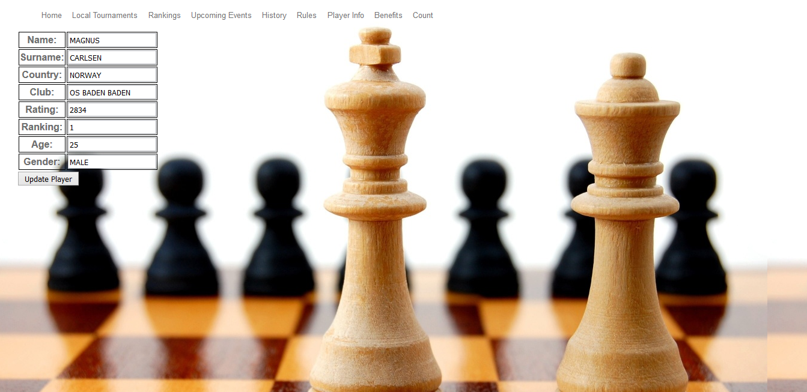

Parts Implemented by Javid Nuriyev
==================================

First thing that the user faces when accessing our site is the main page which is shown below.
When the user clicks at "Rankings" bar in the main page, rankings of the players and related data is shown on that page.

.. figure:: jav_picture/main.png
      :scale: 50 %
      :alt: Main

      *This is the main page*

1. Player Rankings
==================
Click at the Rankings bar

.. figure:: jav_picture/ranking.png
      :scale: 50 %
      :alt: Player Rankings
|
      *This is the Player Rankings page*

+---------------+---------+----------------------------------+-+
| Attribute     | Type    | Explanation                      | |
+===============+=========+==================================+=+
| Name          | string  | Name of the player               | |
+---------------+---------+----------------------------------+-+
| Surname       | string  | Surname of the player            | |
+---------------+---------+----------------------------------+-+
| Country       | string  | Country player represents        | |
+---------------+---------+----------------------------------+-+
| Club          | string  | Club player plays for            | |
+---------------+---------+----------------------------------+-+
| Age           | integer | Age of the player                | |
+---------------+---------+----------------------------------+-+
| Rating        | integer | FIDE rating of the player        | |
+---------------+---------+----------------------------------+-+
| World Ranking | integer | FIDE World Ranking of the player | |
+---------------+---------+----------------------------------+-+
| Gender        | string  | Gender of the player             | |
+---------------+---------+----------------------------------+-+

On the screenshot shown above the player rankings data is displayed.
In this table there are 8 columns displayed to the user. Those columns display the notable data about each top player.
In this table there are countries from another countries page so when doing operations and changing countries data that should be taken into account.
This table can be considered as a generator table because if the user wants to add a player or upate some player data the player name have to be present in this table.
Other than the attributes displayed as columns of the table there is also ID attribute which is used for background operations.
The players are ordered in the table according to their ratings from the player with tp rating to the player with the lowest rating.
There are five operations that can be carried on the table. Those are:
|  1. Add Player
|  2. Find Player
|  3. Find Players by Country
|  4. Delete Player
|  5. Update Player

1.1 Add Player
--------------

At the same page where the table is displayed below the table there are fields which should be filled.
If the user wants to add a player to the table the user should fill the fields shown below and click on the button "Add Player".

.. figure:: jav_picture/add_player.png
      :scale: 50 %
      :alt: Add Player to Player Rankings Table
|
      *Add button is shown at the bottom of the fields*

After the user fills the fields and clicks on the "Add Player" the added player is added to the table and displayed in it.

1.2 Update Player
-----------------

To update the data of the player there are "Update" buttons to the right of each player in the player rankings table. these buttons can be noticed in the image of the player rankings table illustrated above.
When the user wants to update the data of the player in the ranking table it is enough to click on the corresponding "Update" button.

|
       *Clicking on the "Update" button to update a player*

After clicking on the "Update" button a new page is opened. On the new page data of the player that was chosen to be updated by the user is displayed.
Each field can be updated by modifying the data written in the fields and clicking "Update Player" button.
The page mentioned above is illustrated in the figure below.

|
       *Updating player data*

**Important Note**
If the record existing also in another table, i.e. referenced by other table, is wanted to be updated then it is also updated in other tables.

1.3 Find Player
---------------
The player can be searched by typing name and surname of the player which the user wants to display.
After the name and surname is typed into the fields the "Find Player" button should be clicked to perform the action.
The fields where the name and the surname of the player should be written are located below the Player Rankings table nd the Add player fields as shown below.

.. figure:: jav_picture/delete_find.png
      :scale: 50 %
      :alt: Find Player by name and surname
|
       *Searching a player by name and surname*

After the player name and surname is typed into the fields and the button is clicked a new page opens in which the player whose name and surname was typed is displayed with all the data of this player displayed.

|
       *Displaying found player*

1.4 Find Players by Country
---------------------------
Other than searching specific player by writing the name and surname players can be listed by the country they represent.
For this purpose there is a field for writing the country name and searching players according to that.
After entering the country name the "Find Player" button is clicked

|
       *Searching players by country*

After the country is entered and the button is clicked a new page opens which lists all the players that represent the country mentioned in request.

|
       *Displaying players*

1.5 Delete Player
-----------------
The player can be deleted from the list. To delete a player from the list a user just needs to write the name ad surname of the player to be deleted ito the necessary box.
After entering the name and the surname of the player to be deleted "Delete Player" button is clicked.

**Important Note**
A player can be deleted only if it is not referenced by other tables, i.e. a player with the same name and surname does not exist in other tables. In that case it will not be deleted and will be kept in the table.

|
      *Removing players from table*

2. Countries Rankings
=====================
If the user wants to access the countries rankings table the user should click on the "Ranking" at the bar when at home page.
The countries ranking table is located below the players ranking table. This table contains 9 columns which are displayed to the user and there is also one column ID which is used for background operations.
The countries table is referenced by other tables, i.e. it is used by other tables as well.
In other tables while adding players the user has to specify the country and the country should be chosen from the ones that already exist.
The attributes of the table are:

+-------------------------------------+---------+----------+------------------------------------------------+-+-+
| Attribute                           | Type    | Not Null | Explanation                                    | | |
+=====================================+=========+==========+================================================+=+=+
| FIDE Country Rank                   | integer | 1        | country rank in the list                       | | |
+-------------------------------------+---------+----------+------------------------------------------------+-+-+
| Country                             | integer | 1        | name of country                                | | |
+-------------------------------------+---------+----------+------------------------------------------------+-+-+
| Average of Top-10 players           | integer | 1        | average of top-10 chess players of the country | | |
+-------------------------------------+---------+----------+------------------------------------------------+-+-+
| Grand Masters                       | integer | 1        | number of grand masters                        | | |
+-------------------------------------+---------+----------+------------------------------------------------+-+-+
| International Masters               | integer | 1        | number of international masters                | | |
+-------------------------------------+---------+----------+------------------------------------------------+-+-+
| Total Titled                        | integer | 1        | total number of titled players                 | | |
+-------------------------------------+---------+----------+------------------------------------------------+-+-+
| Total Number of Top-100 Players     | integer | 1        | total number of players in top-100             | | |
+-------------------------------------+---------+----------+------------------------------------------------+-+-+
| Highest Ranked Player               | integer | 1        | best player of the country                     | | |
+-------------------------------------+---------+----------+------------------------------------------------+-+-+
| Rating of the Highest Ranked Player | integer | 1        | rating of the best player of that country      | | |
+-------------------------------------+---------+----------+------------------------------------------------+-+-+

|
      *Displaying countries Table*

There are 4 functions that can operate this table those are Add, Update, Find, Delete.

2.1 Add Country
---------------
At the same page with the table displaying countries there are boxes for entering the data. These boxes are located right below the table and they are for entering the data that will be used for adding a new country to the table.
After filling the boxes the user has to click the button "Add Country".

|
      *Adding country to the table*

After the user enters the data and clicks the button a new country is added to the table and it can be seen at the Countries Ranking table.

2.2 Update Country
------------------
There are "Update" buttons next to each country in the table. If the user wats to modify some data components of some specific country then the user must click on the "Update" button standing next to the country which user aims to modify.

|
      *Choosing country to update*

After deciding on which country to update and clicking the button a new page is opened at which all the data of the chosen country is displayed.
At this page data fields of the chosen countru can be modified and fetched to the database after clicking "Update Country"

|
      *Updating country*

After the data is modified and updated the changes take place in the table displaying countries ranking.

**Important Note:**
It is important to mention that the countries table is referenced by other tables, i.e. the members of this table are used by other tables as well, so while updating the countries table if the name of a country is changed it will also change in other tables that have this country.

2.3 Find Country
----------------
There is a box below the table for searching a country. If a user wants to search a country the user has to write a country name into the box and click "Find Country".

|
      *Searching country*

After the name of the country is written and button is clicked result is shown on new page.

|
      *Display found country*

2.4 Delete Country
------------------
Country can be deleted from the table if the user wishes that.
Removal of country from the table can be done by entering the name of the country to the field below the table and and clicking the "Delete Country" button.

|
      *deleting country*

After the click on the button chosen country is removed from the table.

**Important Note:**
One important fact about delete in this table is to remember that country table is referenced by other tables which means that the members of this table are used by other tables as well.
For this reason it is impossible to delete a country which is already used by other table.

3. Player Info Table
====================
In the Player Info table  detailed information about players is provided. This table references the players from the rankings list.
That means that only the players existing in the rankings table can exist in the Player Info table.

+------------------------+---------+------------------------------------------------+-+
| Attribute              | Type    | Explanation                                    | |
+========================+=========+================================================+=+
| Name                   | string  | Name of the player                             | |
+------------------------+---------+------------------------------------------------+-+
| Surname                | string  | Surname of the player                          | |
+------------------------+---------+------------------------------------------------+-+
| Country                | string  | Country player represents                      | |
+------------------------+---------+------------------------------------------------+-+
| Club                   | string  | Club player represents                         | |
+------------------------+---------+------------------------------------------------+-+
| Best Rating            | integer | Best rating ever of the player                 | |
+------------------------+---------+------------------------------------------------+-+
| Best Ranking           | integer | Highest position in FIDE ranking during career | |
+------------------------+---------+------------------------------------------------+-+
| Best Tournament        | string  | Tournament at which best performance was shown | |
+------------------------+---------+------------------------------------------------+-+
| Best Tournament Result | string  | Result at the tournament with best performance | |
+------------------------+---------+------------------------------------------------+-+
| Current Rating         | integer | Current FIDE rating                            | |
+------------------------+---------+------------------------------------------------+-+
| Current Ranking        | integer | Current FIDE world ranking                     | |
+------------------------+---------+------------------------------------------------+-+

To acces the player info table from home page user should click on the "Player Info" tab on the bar.

After the page is accessed we can see the table which is shown below.

|
      *Displaying Player Info Table*

There are 4 operations that can be carried on this table. Those are Add, Update, Delete, Search.

3.1 Add Player Info
-------------------
It is possible to add a player info by filling the boxes right below the Player Info table.
After the data is entered user has to click "Add Player" button.

**Important Note:**
It is very important to keep in mind that the player info table references both player rankings table and countries table. That means that members of both other tables are used in this table.
For the sake of information being coherent and making sense it is only possible to add a player that already exists in the player ranking table and also the country has to exist in countries table.
Otherwise player info can not be added.

|
      *Adding Player Info*

3.2 Update Player Info
----------------------
If the user wishes to update the existing player info then it is enough to just click on the name of the player in the table and a new page will open.

|
      *Choosing object to update*

After the user clicks o the name of the player whose player info is desired to be modified anew page opens where all player info data is displayed.
User can modify data by modifying the contents of the boxes and clicking on the button "Update Player".

|
      *Updating info of the player*

**Important Note:**
Because the player info table references two other tables when updating the data it is important to remember that.

3.3 Search Player Info
----------------------
A user can search for a player info by typing the name and surname of the player into a special box.
After the name and surname of the player whose info is of interest the user clicks on th "Find Player" button.

|
      *Searching info of the player*

After this step a new page is opened at which the requested player's player info is shown.

|
      *Displaying searched player's info*

3.4 Delete Player Info
----------------------
A user can delete player info from a table. To do that a user only needs to enter the name and surname of the player and click on the button "Delete Player"

|
      *Deleting player's info*

After this operation a player whose name and surname was entered ito the box disappears from the Player Info table.

