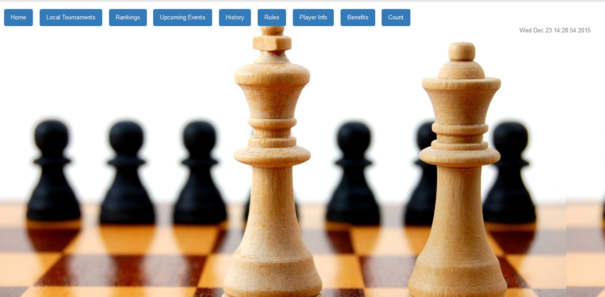

Parts Implemented by Javid Nuriyev
==================================

First thing that the user faces when accessing our site is the main page which is shown below.
When the user clicks at "Rankings" bar in the main page, rankings of the players and related data is shown on that page.

      *This is the main page*

1. Player Rankings
==================
Click at the Rankings bar

      *This is the Player Rankings page*

On the screenshot shown above the player rankings data is displayed.
In this table there are 8 columns displayed to the user. Those columns display the notable data about each top player.
In this table there are countries from another countries page so when doing operations and changing countries data that should be taken into account.
This table can be considered as a generator table because if the user wants to add a player or upate some player data the player name have to be present in this table.
Other than the attributes displayed as columns of the table there is also ID attribute which is used for background operations.
The players are ordered in the table according to their ratings from the player with tp rating to the player with the lowest rating.
There are five operations that can be carried on the table. Those are:
1. Add Player
2. Find Player
3. Find Players by Country
4. Delete Player
5. Update Player

1.1 Add Player
--------------

At the same page where the table is displayed below the table there are fields which should be filled.
If the user wants to add a player to the table the user should fill the fields shown below and click on the button "Add Player".

.. figure:: jav_picture/add_player.png
      :scale: 50 %
      :alt: Add Player to Player Rankings Table

      *Add button is shown at the bottom of the fields*

After the user fills the fields and clicks on the "Add Player" the added player is added to the table and displayed in it.

1.2 Update Player
-----------------

To update the data of the player there are "Update" buttons to the right of each player in the player rankings table. these buttons can be noticed in the image of the player rankings table illustrated above.
When the user wants to update the data of the player in the ranking table it is enough to click on the corresponding "Update" button.

.. figure:: jav_picture/update_button.png
      :scale: 50 %
      :alt: Click on the Update button of the Player you want to modify

After clicking on the "Update" button a new page is opened. On the new page data of the player that was chosen to be updated by the user is displayed.
Each field can be updated by modifying the data written in the fields and clicking "Update Player" button.
The page mentioned above is illustrated in the figure below.

.. figure:: jav_picture/update_player.png
      :scale: 50 %
      :alt: Update the data you want to modify
      
**Important Note**
If the record existing also in another table, i.e. referenced by other table, is wanted to be updated then it is also updated in other tables.

1.3 Find Player
---------------
The player can be searched by typing name and surname of the player which the user wants to display.
After the name and surname is typed into the fields the "Find Player" button should be clicked to perform the action.
The fields where the name and the surname of the player should be written are located below the Player Rankings table nd the Add player fields as shown below.

.. figure:: jav_picture/delete_find.png
      :scale: 50 %
      :alt: Find Player by name and surname

After the player name and surname is typed into the fields and the button is clicked a new page opens in which the player whose name and surname was typed is displayed with all the data of this player displayed.

.. figure:: jav_picture/find_page.png
      :scale: 50 %
      :alt: Found player is shown in new page
      
1.4 Find Players by Country
---------------------------
Other than searching specific player by writing the name and surname players can be listed by the country they represent.
For this purpose there is a field for writing the country name and searching players according to that.
After entering the country name the "Find Player" button is clicked

.. figure:: jav_picture/find_player_by_country.png
      :scale: 50 %
      :alt: Find player by country
      
After the country is entered and the button is clicked a new page opens which lists all the players that represent the country mentioned in request.

.. figure:: jav_picture/find_player_by_country_page.png
      :scale: 50 %
      :alt: Find player by country
      
1.5 Delete Player
-----------------
The player can be deleted from the list. To delete a player from the list a user just needs to write the name ad surname of the player to be deleted ito the necessary box.
After entering the name and the surname of the player to be deleted "Delete Player" button is clicked.

**Important Note**
A player can be deleted only if it is not referenced by other tables, i.e. a player with the same name and surname does not exist in other tables. In that case it will not be deleted and will be kept in the table.

.. figure:: jav_picture/delete_find.png
      :scale: 50 %
      :alt: Find Player by name and surname

 
 
      

       
 

