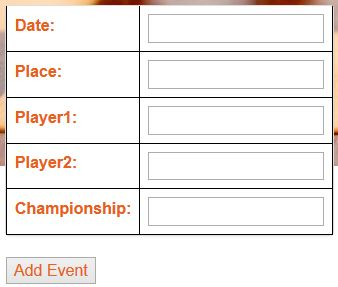
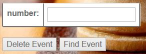
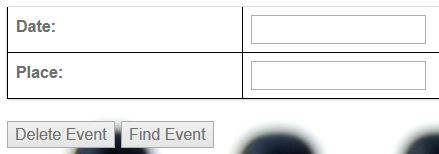
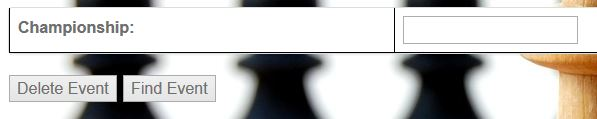

Parts Implemented by Ira Shyti
==============================

The user canacces the "Upcoming events" table and the "Championships" table by clicking the *upcoming events* button on the
top of the home page.

Upcoming events
---------------
The *upcoming events* table has six columns and the primary key of the table is the *number*. The user
can do *add*, *delete*, *find* and *update* operations on this table. The user should take in considerance that the
*championship* attribute of this table is refereced from the *championships* table.

Add event
+++++++++
The user can add an event by entering all the information that is required. The user should take in considerance that all data
should be completed since in the SQL code they are defined as not NULL. Another thing that should be considered also is that
can not add an event of the same date with any event that is already on the table. Another restriction is also the fact that
the championship attribute is referenced by the *championship*table, so the user can not add any event of a championship that
is not pasrt od the *championship* table.

      *This is the the *add event* table*

Find or Delte event
+++++++++++++++++++
For the *upcoming events* table there are 3 different ways by which a user can find or delete an event. First way is to find
or delte an event by its number. User enters the number of the event and than chooses one of the options, add or delete, and
presses the respective button. The second way is by entering the date and place of the event. And the last way is by entering
the championship that the events is part of. When choosing to find an event by its championship, all the events of the entered
championship will be shown.

Update event
++++++++++++
The user can update an event by pressing the *update event* button on the rightmost column of the event they want to update.
When the user presses the *update event* button,  new page will open which shows a table with all the attributes of the event.
The user should take in considerance that the championship attribute can not be edited since it is referenced to the
*championships* table.

Championships table
-------------------
The *championship* table has five columns. The table shows nformation of the championship, when will it take place, the
number of total players that will participate, and the number of tatal games that will be played.The primary key of the
table is the number attribute. This tables *championship* attribute is a foreign key to the *upcoming events* table.

